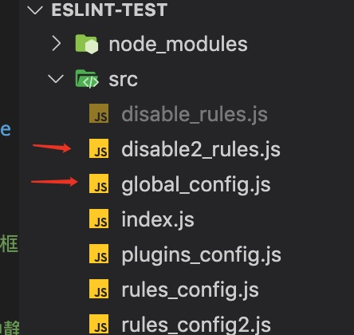

## ESlint CLI

通过yarn 或者 Npm 全局安装 ESlint工具

> Npm:

```bash
$ npm i -g eslint
```

> yarn

```
$ yarn add eslint global
```


使用ESlint CLI

```
eslint file1 file2....
```

或:

```
eslint dir/** or eslint "dir/**"
```

Note:  

> 这里的 **是node glob语法。


## 基本配置过程

cli安装方式可选择本地也可以全局安装，如上讲述

安装好后，添加配置文件。运行如下命令会在项目中自动创建配置文件 .eslintrc[.js]

```bash
$ eslint --init 
```

Note: 一定运行nom init 初始化创建包描述文件，否则上述命令运行无任何效果，也不会创建eslint配置文件。

如果本地安装CLI，初始化则

```
$ ./node_modules/.bin/eslint --init
```

Tips:

> ./node_modules/.bin 该目录是存放包中所需的命令行工具


### rules 规则

> 在配置文件中.eslint.js 中rules字段中指定规则，每一项规则都依照官方文档来进行添加配置，默认没想规则都是被禁用的。可以在配置中添加 extends": "eslint:recommended" 启动官方推荐的规则

官方规则预览


**示列: 如下是在配置文件中，设置规则。**

```json
{
    "rules": {
        "semi": ["error", "always"],	// 强制统一分号 
        "quotes": ["error", "double"]	//
    }
}

/*
	规则解释：
	semi: 该规则用来统一js代码中的分号，避免js 自动分号机制(ASI)有时候带来的歧义导致解析器崩掉。
	options
	该规则配置有两个选项
	 对象
	  若为always
	  "omitLastInOneLineBlock": true 忽略花括号在同一行（内容也就在同一行了）的语句块中的
最后一个分号
		若为 never
      "beforeStatementContinuationChars": "any" (默认) 如果下一句以 [、(、/、+ 或 				- 开头，忽略句末分号 (或缺少分号)。
  		"beforeStatementContinuationChars": "always" 如果下一句以 [、(、/、+ 或 - 开					头，要求句末有分号。
  		"beforeStatementContinuationChars": "never" 如果下一句以 [、(、/、+ 或 - 				开头，禁止末尾有分号
	 字符串
	 	- always: 要求在语句末尾使用分号
	 	- never: 禁止在语句使用分号
	 
		
*/
```

每项规则级别 解释，即每一个规则第一个配置参数

- `"off"` or `0` - 关闭规则
- `"warn"` or `1` - 将规则视为一个警告（不会影响退出码）
- `"error"` or `2` - 将规则视为一个错误 (退出码为1)

> Note: 这三个错误级别可以允许你细粒度的控制 ESLint 是如何应用规则， 只有在你的配置文件中扩展了一个可分享的配置或者明确开启一个规则，ESLint 才会去校验你的代码。

配置插件下的规则:

```
插件名/规则ID: 【规则设置】

tips: 当指定来自插件的规则时，确保删除 eslint-plugin- 前缀。ESLint 在内部只使用没有前缀的名称去定位规则。
```


**或者内链注释设置规则.**

```javascript
// 内链注释禁用规则 no-var
/* eslint-disable no-var */
	var a = 2
/* eslint-disable no-var */
```


**禁用一组文件在配置文件中的规则**

实列:

如此目录结构:



```javascript

// 模式
{
  "rules": {...},
  "overrides": [
    {
      "files": ["*-test.js","*.spec.js"],
      "rules": {
        "no-unused-expressions": "off"
      }
    }
  ]
}
  
 //实列:
{
   "overrides":[
        {
            "files":["*_rules.js"],
            "rules":{
                "no-var": "off"
            }
        }
    ] // 指定文件设置规则
}
```

Note: 配置文件中注释内链注释行为.

> 配置文件中 添加 ```  "noInlineConfig": true```
>
> 报告使用eslint-disable注释行为的文件: ``"reportUnusedDisableDirectives": true,"``


## ESLInt 配置明细

> eslint 完全可配置。可以只使用一个规则，或者运行基本语法验证。或者使用自定义规则和默认绑定的规则。

### 配置方式:


1. Configuration Comments 使用javascript 注释把配置信息直接嵌入到一个代码源文件中。

2. 使用配置文件 .eslintrc.js 或者在package.json的eslintConfig字段中配置，eslint会自动查找配置位置并读取应用配置。或者通过Eslint config*file指定配置文件

### 使用配置文件

1. 直接使用配置文件, eslint进程运行会自动在lint文件所在目录向外查找配置，一直到根目录. 这种会合并配置.除非指定root

2. 在命令行中传入 -c config*file    指定配置文件.

   Note:

   > 如果指定自定义配置文件的同时，需要禁用默认配置文件.eslint.* 需要 同时传入 --no-eslintrc参数.


### 配置级链和层次结构

最佳实践: 只在项目根目录下设置配置文件 ，并在配置文件中设置 ```root: ture```

> 如果同一目录下 `.eslintrc` 和 `package.json` 同时存在，`.eslintrc` 优先级高会被使用，`package.json` 文件将不会被使用。

### 配置文件格式


- javascript ,  官方文件格式定义 .eslintrc.js. 模块化到处一个配置信息对象。对于现在的框架来说通常都是模块整合了。所以通常是

  ```javascript
  module.exports = {
  	rules:{
  		/*规则*/
  	}
  }
  
  ```

  如果使用命令行手动是初始化配置可以选择 JSON格式配置，而不是模块化导出.

- .yaml 使用.eslintrc.yaml 或 .eslint.yml定义配置文件

- JSON格式 使用 .eslintrc.json格式配置。

- 在package.json文件 eslintConfig字段指定配置

- .eslintrc格式，已废弃


完整的配置层次结构，从最高优先级最低的优先级，如下:

1. 行内配置

   1. `/*eslint-disable*/` 和 `/*eslint-enable*/`
   2. `/*global*/`
   3. `/*eslint*/`
   4. `/*eslint-env*/`

2. 命令行选项（或 CLIEngine 等价物）：

   1. `--global`
   2. `--rule`
   3. `--env`
   4. `-c`、`--config`

3. 项目级配置：

   1. 与要检测的文件在同一目录下的 `.eslintrc.*` 或 `package.json` 文件
   2. 继续在父级目录寻找 `.eslintrc` 或 `package.json`文件，直到根目录（包括根目录）或直到发现一个有`"root": true`的配置。

   > 如果同一目录中有多个配置文件。使用配置优先级规则是
   >
   > 1. .eslintrc.js
   > 2. .eslintrc.yaml 
   > 3. .eslintrc.yml
   > 4. .eslintrc.json
   > 5. package.json

4. 如果不是（1）到（3）中的任何一种情况，退回到 `~/.eslintrc` 中自定义的默认配置。

   

### 配置文件字段

- **Environments** - 指定脚本的运行环境。每种环境都有一组特定的预定义全局变量。在脚本文件中 表示为 'env'字段

  可用环境

  - `browser` - 浏览器环境中的全局变量。
  - `node` - Node.js 全局变量和 Node.js 作用域。
  - `commonjs` - CommonJS 全局变量和 CommonJS 作用域 (用于 Browserify/WebPack 打包的只在浏览器中运行的代码)。
  - `shared-node-browser` - Node.js 和 Browser 通用全局变量。
  - `es6` - 启用除了 modules 以外的所有 ECMAScript 6 特性（该选项会自动设置 `ecmaVersion` 解析器选项为 6）。
  - `worker` - Web Workers 全局变量。
  - `amd` - 将 `require()` 和 `define()` 定义为像 [amd](https://github.com/amdjs/amdjs-api/wiki/AMD) 一样的全局变量。
  - `mocha` - 添加所有的 Mocha 测试全局变量。
  - `jasmine` - 添加所有的 Jasmine 版本 1.3 和 2.0 的测试全局变量。
  - `jest` - Jest 全局变量。
  - `phantomjs` - PhantomJS 全局变量。
  - `protractor` - Protractor 全局变量。
  - `qunit` - QUnit 全局变量。
  - `jquery` - jQuery 全局变量。
  - `prototypejs` - Prototype.js 全局变量。
  - `shelljs` - ShellJS 全局变量。
  - `meteor` - Meteor 全局变量。
  - `mongo` - MongoDB 全局变量。
  - `applescript` - AppleScript 全局变量。
  - `nashorn` - Java 8 Nashorn 全局变量。
  - `serviceworker` - Service Worker 全局变量。
  - `atomtest` - Atom 测试全局变量。
  - `embertest` - Ember 测试全局变量。
  - `webextensions` - WebExtensions 全局变量。
  - `greasemonkey` - GreaseMonkey 全局变量。

  

  特定插件的环境

  - 首先是安装插件
  - 在plugins配置插件
  - 在env字段中配置 以不带前缀的 插件名/环境名 设置

  ```javascript
  {
      "plugins": ["example"],
      "env": {
          "example/custom": true
      }
  }
  ```

  

- **Globals** - 脚本在执行期间访问的额外的全局变量。

  > 在globals字段中指定额外全局变量， 如果未指定，lint检查不会通过，直接未定义处理。

  测试:

  ```javascript
  //通过注释
  // 在源代码中，通过注释配置全局变量
  /*globals $: readonly, window: writable*/
  window = 2
  $ = 3
  ```

   ```javascript
  // 配置文件, 截取部分配置
  .....
   "globals":{
          "var1": "readonly",
          "var2": "writable"
      }, // 指定全局变量
  .....
   ```

  Note: 

  > 由于历史原因，布尔值 `false` 和字符串值 `"readable"` 等价于 `"readonly"`。类似地，布尔值 `true` 和字符串值 `"writeable"` 等价于 `"writable"`。但是，不建议使用旧值。要启用[no-global-assign](https://eslint.bootcss.com/docs/rules/no-global-assign)规则来禁止对只读的全局变量进行修改。默认推荐 已经启用

  可以在源文件里、在配置文件中或使用 [命令行](https://eslint.bootcss.com/docs/user-guide/command-line-interface) 的 `--env` 选项来指定环境。

- **Rules** - 启用的规则及其各自的错误级别。脚本文件中表示字段为 'rules'

- parserOtions(js语言解析器)

  > 设置解析器选项能帮助 ESLint 确定什么是解析错误，所有语言选项默认都是 `false`.设置 javascript标准，默认情况，e slint只支持对ecma5语法校验。对于新的es标准或JSX需要覆盖设置

  > 注意如果需要支持React 的JSX语法，需要使用 eslint-plugin-react插件。因为基础的eslint的jsx配置无法完全匹配react jsx语法。
  >
  > 启动对es6语法支持 { "parserOptions": { "ecmaVersion": 6 } }。如果需要启动对es6的全局变量支持还需要配置 { "env":{ "es6": true } }.，这个会自动启动对es6全局变量支持，如果单单启动第一项仅仅是支持es6语法

  

  该选项可用字段:

  - ecmaVersion: 设置 javascript版本，可以设置为数字,比如 es 5直接就是 ecmaVersion: 5, 以此类推； 或者以年份设值: 2015, 2016, 2017.....
  - sourceType: 设置 script 或者 module(如果是模块化则是 module值)
  - ecmaFeatures:
    - `globalReturn` - 允许在全局作用域下使用 `return` 语句
    - `impliedStrict` - 启用全局 [strict mode](https://developer.mozilla.org/en-US/docs/Web/JavaScript/Reference/Strict_mode) (如果 `ecmaVersion` 是 5 或更高)
    - `jsx` - 启用 [JSX](http://facebook.github.io/jsx/)
    - `experimentalObjectRestSpread` - 启用实验性的 [object rest/spread properties](https://github.com/sebmarkbage/ecmascript-rest-spread) 支持。(**重要：**这是一个实验性的功能,在未来可能会有明显改变。 建议你写的规则 **不要** 依赖该功能，除非当它发生改变时你愿意承担维护成本。)

  

  

- Parser:

  > ESLint 默认使用[Espree](https://github.com/eslint/espree)作为其解析器，可以在配置文件中自定义解析器

  与eslint兼容解析器有

  - [Esprima](https://www.npmjs.com/package/esprima)
  - [Babel-ESLint](https://www.npmjs.com/package/babel-eslint) - 一个对[Babel](https://babeljs.io/)解析器的包装，使其能够与 ESLint 兼容。如果要在代码中使用实验性js，使用该解析器能够进行代码校验.
  - [@typescript-eslint/parser](https://www.npmjs.com/package/@typescript-eslint/parser) - 将 TypeScript 转换成与 estree 兼容的形式，以便在ESLint中使用。对ts语法格式规范。

  

  Note:在使用自定义解析器时，为了让 ESLint 在处理非 ECMAScript 5 特性时正常工作，配置属性 `parserOptions` 是必须的。**解析器会被传入 `parserOptions`，但是不一定会使用它们来决定功能特性的开关。** 传入自定义解析器时候，结合配置 parserOptions,避免自定义解析器不能正常工作。

  

- `processor`：

  > 指定处理器，处理器可以从另一种文件中提取 JavaScript 代码，然后让 ESLint 检测 JavaScript 代码。或者处理器可以在预处理中转换 JavaScript 代码。 插件有提供处理器，可以在plugins键中指定插件的同时，设置处理器 
  >
  > > 设置格式为: 插件名/处理器名

  如下

  ```javascript
  // 使用 a-plugin插件中带有的处理器 a-processor
  {
      "plugins": ["a-plugin"],
      "processor": "a-plugin/a-processor"
  }
  ```

  

  processor配合overrides, plugins指定文件类型，设置处理器。从非js文件类型中，提取j s代码，并检查js代码格式

  比如

  ```javascript
  {
      "plugins": ["a-plugin"],
      "overrides": [
          {
              "files": ["*.md"],
              "processor": "a-plugin/markdown"		
          }
      ]
  }
  ```

  

  

- root 

  >  项目级目录级配置, 项目中需要对不同层级目录的代码code检查，就会出现多个配置文件。运行lint检查，会将配置文件合并，通常目录级配置优先级高。可以为配置文件设置 ```root: true``` 作为根级别配置。这样lint运行就不会在向下合并。

- Plugins:

  > 启用 三方插件，必须安装 （npm or yarn）, 在配置文件中配置插件，可以省略插件前缀。

  Note:

  > 插件是相对于 ESLint 进程的当前工作目录解析的, 也就是相对于 项目中  node_moules目录解析插件位置

  测试：配置eslint-plugin-prettier

  >[eslint-plugin-prettier](https://github.com/prettier/eslint-plugin-prettier): 该插件辅助Eslint可以平滑地与Prettier一起协作，并将Prettier的解析作为Eslint的一部分，在最后的输出可以给出修改意见。这样当Prettier格式化代码的时候，依然能够遵循我们的Eslint规则。如果你禁用掉了所有和代码格式化相关的Eslint规则的话，该插件可以更好得工作。所以你可以使用eslint-config-prettier禁用掉所有的格式化相关的规则(如果其他有效的Eslint规则与prettier在代码如何格式化的问题上不一致的时候，报错是在所难免的了)

  ​	相关:

  - [prettier](https://github.com/prettier/prettier)：原始实现版本，定义了prettier规则并实现这些规则。支持的规则参考：[传送门](https://prettier.io/docs/en/options.html)

  - [prettier-eslint](https://github.com/prettier/prettier-eslint)：输入代码，执行prettier后再eslint --fix输出格式化后的代码。仅支持字符串输入。

  - [prettier-eslint-cli](https://github.com/prettier/prettier-eslint-cli)：顾名思义，支持CLI命令执行[prettier-eslint](https://github.com/prettier/prettier-eslint)的操作
  - [eslint-config-prettier](https://github.com/prettier/eslint-config-prettier): 将会禁用掉所有那些非必须或者和[prettier](https://github.com/prettier/prettier)冲突的规则。这让您可以使用您最喜欢的shareable配置，而不让它的风格选择在使用Prettier时碍事。请注意该配置**只是**将规则**off**掉,所以它只有在和别的配置一起使用的时候才有意义。
  - 

  

  **prettier相关依赖关系解释:**

  最基础的是prettier，然后你需要用eslint-config-prettier去禁用掉所有和prettier冲突的规则，这样才可以使用eslint-plugin-prettier去以符合eslint规则的方式格式化代码并提示对应的修改建议。为了让prettier和eslint结合起来，所以就诞生了prettier-eslint这个工具，但是它只支持输入代码字符串，不支持读取文件，因此又有了prettier-eslint-cli

  

  配置： 测试

  ```javascript
  // 安装 插件
  // 配置
   "plugins":["prettier"], //设置插件, 拓展eslint框架能力
   "rules": {  // 设置规则
      "prettier/prettier": ["error"]
    }
  
  ```

  

### extends扩展配置文件

 	extends:

​		1. 指定配置的字符串(配置文件的路径、可共享配置的名称、`eslint:recommended` 或 `eslint:all`)

​		2. 字符串数组：每个配置继承它前面的配置

​	rules: 属性可以做下面的任何事情以扩展（或覆盖）规则：

​	启用额外的规则

​	改变继承的规则级别而不改变它的选项：

​		基础配置：`"eqeqeq": ["error", "allow-null"]`

​		派生的配置：`"eqeqeq": "warn"`

​		最后生成的配置：`"eqeqeq": ["warn", "allow-null"]`

​	覆盖基础配置中的规则的选项

​		基础配置：`"quotes": ["error", "single", "avoid-escape"]`

​		派生的配置：`"quotes": ["error", "double"]`

​		最后生成的配置：`"quotes": ["error", "double"]`

rules规则扩展覆盖实践

```javascript
 ......
"rules": {  // 设置规则
        "no-dupe-keys": ["error"],   // 对象声明中静止使用重复key
        "no-var": ["error"],
        "prettier/prettier": ["error"],
        "quotes": ["error", "single", "avoid-escape"],	// 覆盖基础配置中的规则的选项
        "quotes": ["error", "double"],
    },
 .......
```


### 可共享配置

> 即使用npm 平台发布的三方配置包. 使用是确保在当前项目安装。比如: eslint-config-airbnb, eslint-config-standard

extends可以省略 包名前缀 eslint-config-

使用

```
extends:["standard"]
```


### 使用插件配置

> [插件](https://eslint.bootcss.com/docs/developer-guide/working-with-plugins) 是一个 npm 包，通常输出规则。一些插件也可以输出一个或多个命名的 [插件配置输出](https://eslint.bootcss.com/docs/developer-guide/working-with-plugins#configs-in-plugins)。要确保这个包安装在 ESLint 能请求到的目录下。

`plugins` [属性值](https://eslint.bootcss.com/docs/user-guide/configuring#configuring-plugins) 可以省略包名的前缀 `eslint-plugin-`。

`extends` 属性值可以由以下组成：

- `plugin:`
- 包名 (省略了前缀，比如，`react`)
- `/`
- 配置名称 (比如 `recommended`)

从插件使用配置实践

```
....
"plugins": [
     "react"
 ],
 "extends": [
     "eslint:recommended",
     "plugin:react/recommended"	// 这是插件输出的配置 plugin: 报名/输出配置名
  ],
 ....
```

### 使用 "eslant: all"

`extends` 属性值可以是 `"eslint:all"`，启用当前安装的 ESLint 中所有的核心规则。这些规则可以在 ESLint 的任何版本进行更改。

**重要：**这些配置 **不推荐在产品中使用**，因为它随着 ESLint 版本进行更改。使用的话，请自己承担风险。

Tips: 如果你的配置扩展了所有的核心规则：在你升级到一个新的大或小的 ESLint 版本，在你使用[命令行](https://eslint.bootcss.com/docs/user-guide/command-line-interface#fix)的 `--fix` 选项之前，检查一下报告的问题，这样你就知道一个新的可修复的规则将更改代码。

官方配置(.json)实列

```javascript
module.exports = {
    "extends": "eslint:all",
    "rules": {
        // override default options
        "comma-dangle": ["error", "always"],
        "indent": ["error", 2],
        "no-cond-assign": ["error", "always"],

        // disable now, but enable in the future
        "one-var": "off", // ["error", "never"]

        // disable
        "init-declarations": "off",
        "no-console": "off",
        "no-inline-comments": "off",
    }
}
```


### 基于glob模式的配置

应用规则:

- Glob 模式覆盖只能在配置文件 (`.eslintrc.*` 或 `package.json`) 中进行配置。
- 模式应用于相对于配置文件的目录的文件路径。 比如，如果你的配置文件的路径为 `/Users/john/workspace/any-project/.eslintrc.js` 而你要检测的路径为 `/Users/john/workspace/any-project/lib/util.js`，那么你在 `.eslintrc.js` 中提供的模式是相对于 ` lib/util.js` 来执行的.
- 在相同的配置文件中，Glob 模式覆盖比其他常规配置具有更高的优先级。 同一个配置中的多个覆盖将按顺序被应用。也就是说，配置文件中的最后一个覆盖会有最高优先级。
- 一个 glob 特定的配置几乎与 ESLint 的其他配置相同。覆盖块可以包含常规配置中的除了root之外的其他任何有效配置选项，
  - 一个 glob 特定的配置可以有 `extends` 设置，但是会忽略扩展配置中的 `root` 属性。
  - 只有当父配置和子配置的 glob 模式匹配时，才会应用嵌套的 `overrides` 设置。当扩展配置具有 `overrides` 设置时也是如此。
- 可以在单个覆盖块中提供多个 glob 模式。一个文件必须匹配至少一个配置中提供的模式。
- 覆盖块也可以指定从匹配中排除的模式。如果一个文件匹配了任何一个排除模式，该配置将不再被应用。


实列:

### Relative glob patterns

```
project-root
├── app
│   ├── lib
│   │   ├── foo.js
│   │   ├── fooSpec.js
│   ├── components
│   │   ├── bar.js
│   │   ├── barSpec.js
│   ├── .eslintrc.json
├── server
│   ├── server.js
│   ├── serverSpec.js
├── .eslintrc.json
```

配置 glob

```
{
  "rules": {
    "quotes": ["error", "double"]
  },

  "overrides": [	// 正对特定目录文件，细粒度配置lint规则
    {
      "files": ["bin/*.js", "lib/*.js"],
      "excludedFiles": "*.test.js",	//排除文件
      "rules": {
        "quotes": ["error", "single"]
      }
    }
  ]
}
```

解释:

> 在 `app/.eslintrc.json` 文件中的配置定义了 `**/*Spec.js` glob 模式。该模式相对于 `app/.eslintrc.json` 的基准目录。因此，该模式匹配 `app/lib/fooSpec.js` 和 `app/components/barSpec.js`，但 **不匹配** `server/serverSpec.js`。如果你在项目根目录的 `.eslintrc.json` 文件中定义相同的模式，它将匹配所有三个 `*Spec` 文件。


### 配置文件使用注释

```json
{
    "env": {
        "browser": true
    },
    "rules": {
        // Override our default settings just for this directory
        "eqeqeq": "warn",
        "strict": "off"
    }
}
```


### 忽略检测

> 指定不需要被eslint检测的文件

1. 使用备用文件， .eslintignore
2. 在package.json中指定eslintIgnore: [files....]


附：

Node_glob


## 参考

- [ESLint_共享包配置](https://eslint.bootcss.com/docs/developer-guide/shareable-configs)

- [ESLiint_插件配置](https://eslint.bootcss.com/docs/developer-guide/working-with-plugins#configs-in-plugins)

- [Node_glob模式](https://blog.csdn.net/guang_s/article/details/90379694)

- [ESLint_GitHub](https://github.com/eslint/eslint)

  


