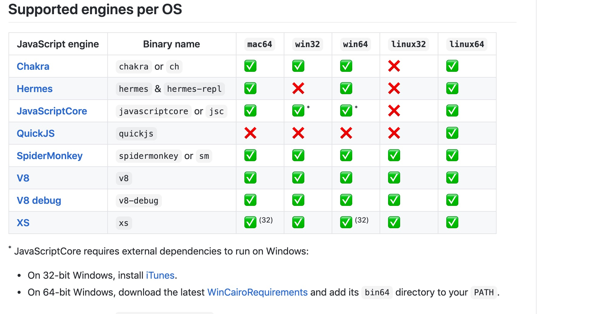

---

title: 手动构建javascript测试环境

author: Pachverb

date: 2020-09-17

location: 川信

description: 搭建javascript宿主环境，完成相关调试

tag: programm

tags:

   -JavaScript

---

## 准备工具

 - jsvu

   > 该工具由google公司开发，用于管理javascript引擎版本的交互式CLI

 - Eshost

   > 提供运行脚本代码和javascript引擎的宿主环境

- eshost-cli

  > 提供javascript引擎的宿主环境的交互式CLI

## 工具(Mac OS)安装:

```bash
npm i -g jsvu 
```

或

```bash
yarn add jsvu global
```

安装引擎

通过tsvu工具安装js引擎(Mac os)

```bash
tsvu 

# 指定版本安装
# tsvu engin-name@versions
tsvu chakra@7.x
```

macos系统下此命名行会提示合适的主机版本，以及所要安装的js引擎

*Note: 指定版本安装，如果指定版本本身不存在，会提示报错*

**目前官方支持的js引擎列表**



## 装载安装的js Engines

```bash
# mac os
# 指定装载版本
eshost --add 'Chakra' ～/.jsvu/chakra

# 全部装载
eshost --configure-jsvu
```

下载的安装文件路径在 

/Users/[home]/.jsvu/

```bash
# 指定表达式
eshost -e "1+1"

# 指定语句
eshost -tsx 'print(1+2)'

# 指定文件
eshost -ts 'test.js'

# 指定引擎运行代码
eshost -h '1+1'
```


## engins管理

```
tsvu --engines = chakra, javascriptCore...
```

Tips: 指定需要管理的引擎版本，不再列表之类的不会执行更新， 因直接执行```jsvu``会更新所有安装引擎。


## 参考

[jsvu_repo](https://github.com/GoogleChromeLabs/jsvu)

[eshost_repo](https://github.com/bterlson/eshost#installing-engines)

[eshost-cli_repo](https://github.com/bterlson/eshost-cli)