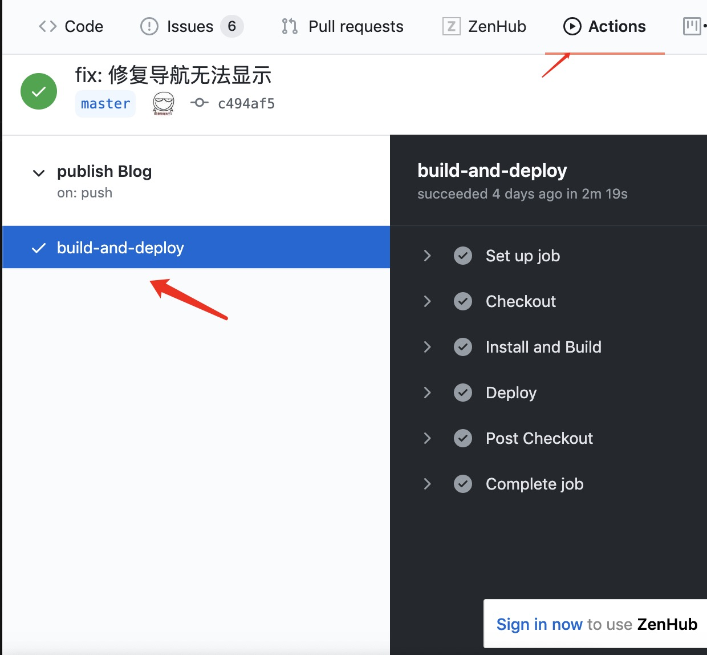
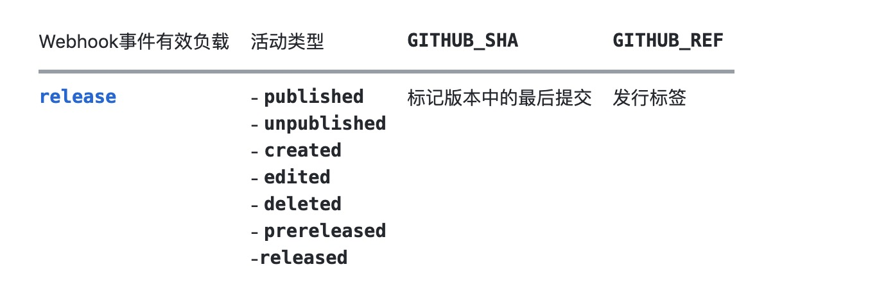
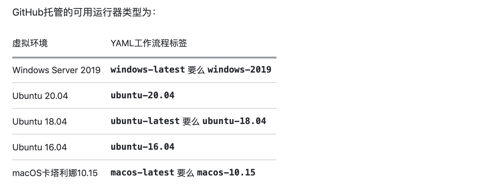

## 介绍
github actions同其他持续集成工具一样，trivas CI. actions也拥有 拉去代码，运行测试，登陆远程服务器共能，发布到第三方服务.

github actions的一次工作流是通过项目 .github/workflow目录下的 .yml格式文件来指定具体的工作流程的。在每次像远程交付代码时，后台就会检测此目录中的文件，来触发相应工作流程。

## workflow基本流程板块

（1）workflow （工作流程）：持续集成一次运行的过程，就是一个 workflow。

（2）job （任务）：一个 workflow 由一个或多个 jobs 构成，含义是一次持续集成的运行，可以完成多个任务。

（3）step（步骤）：每个 job 由多个 step 构成，一步步完成。

（4）action （动作）：每个 step 可以依次执行一个或多个命令（action）。

## 语法
> 由于workflow配置很多，只做基本配置介绍。此处以我的一个项目的workflow配置为列,。


```
# 我的博客项目自动化配置
name: publish Blog
on:
  push:
    branches: 
      - master 
jobs:
  build-and-deploy:
    runs-on: ubuntu-latest
    steps:
      - name: Checkout
        uses: actions/checkout@v2.3.1
        with:
          persist-credentials: false

      - name: Install and Build 
        run: |
          yarn
          yarn build

      - name: Deploy 
        uses: JamesIves/github-pages-deploy-action@3.5.9
        with:
          GITHUB_TOKEN: ${{ secrets.TOKEN }}
          BRANCH: gh-pages 
          FOLDER: src/.vuepress/dist 
```
1. name
> 表示一次workflow工作流的命名。

具体结果可在github仓库主页的actions选项可查, 比如我的


2. on 
> workflow触发条件。可以是字符串，也可以是数组.

配置方式
(1) 单个事件
如上我的项目中的workflow文件就是单个事件类型的配置, 而且指配置master分支作为触发条件

pull_request和 push两种事件类型，可以配置branch 和tag字段作为触发条件

比如
```
on:
  push:
    branches:    
      - master
      - 'mona/octocat'
      - 'releases/**'
    tags:        
      - v1             
      - v1.*          
```
(2) 事件列表
不需要精细配置每个webhook
```
on: [push, pull_request]
```
(3) 事件列表且活动类型配置
针对release事件类型，存在 published，unpublished，created，edited，deleted，或prereleasedd多种活动类型。
```
on:
  push:
    branches:
      - master
  pull_request:
    branches:
      - master
  page_build:
  release:
    types: # 该配置下存在活动类型配置
      - created
```
针对上述release事件类型,所拥有的活动类型


3. jobs
> 指定一次workflow需要完成的具体任务。

jobs.<job_id>

可以指定一个或多个任务,任务对应 指定的job.id。每一个任务包括一个或多个steps. 

jobs.<job_id>.name
显示在GitHub上的作业名称。

jobs.<job_id>.needs
默认情况下，作业并行运行。要顺序运行作业，可以使用jobs.<job_id>.needs关键字定义对其他作业的依赖关系。
```
jobs:
  job1:
  job2:
    needs: job1
  job3:
    needs: [job1, job2]
```
jobs.<job_id>.runs-on 
指定作业运行的机器类型, 该机器可以是GitHub托管的运行程序，也可以是自托管的运行程序。**必须在每个任务之前指定该字段**

如上，我的workflow就指定了github内置机型 ```ubuntu-latest```




jobs.<job_id>.steps
> 设置一次任务完成，所涉及的步骤. 可以包括一个或多个steps。注意这玩意儿过度开销是会被官方监控的，收费。

每一个步骤所包含流程

- jobs.<job_id>.steps.name：步骤名称。
- jobs.<job_id>.steps.run：该步骤运行的命令或者 action。
- jobs.<job_id>.steps.env：该步骤所需的环境变量。


## 实战
我的博客项目workflow, 使用github actions自动化没部署到github pages

流程:

1. 在github开通blog的github repo. 我看网上很多教程在创建远程仓库的时候都是将 仓库名设置为 一个特殊仓库 如[你的github账号名称].github.io。个人实践完全不需要，不影响项目部署。 这个服务是官方提供，仓库的文件资源，最后都是官方检测资源依赖关系并生成站点的。

2. 初始化完成后，还需要创建一个空分支，gh-pgs. 这是官方github pages服务部署的指定分支

3. 设置个人开发令牌
步骤: 个人github主页--> 点击头像在菜单中选择 setting --> 新切换页面中 点击 develper-setting --> 新进页面中 点击 Personal access tokens -- 创建 一个新令牌即可。 最后在仓库中添加令牌

4. 在仓库中创建一个空workflow文件，在pull到本地进行配置

完成配置，推送即可

我的blog项目workflow配置

```
name: publish Blog
on:
  push:
    branches: 
      - master 
jobs:
  build-and-deploy:
    name: build_deploy
    runs-on: ubuntu-latest
    steps:
      - name: Checkout
        uses: actions/checkout@v2.3.1
        with:
          persist-credentials: false

      - name: Install and Build 
        run: |
          yarn
          yarn build

      - name: Deploy 
        uses: JamesIves/github-pages-deploy-action@3.5.9
        with:
          GITHUB_TOKEN: ${{ secrets.TOKEN }}
          BRANCH: gh-pages 
          FOLDER: src/.vuepress/dist 

```

## 参考
[官方Github Actions DOCS](https://docs.github.com/en/actions/reference/workflow-syntax-for-github-actions)


## 结语
后期会更新其他持续集成工具，欢迎下方留言评论，谢谢


